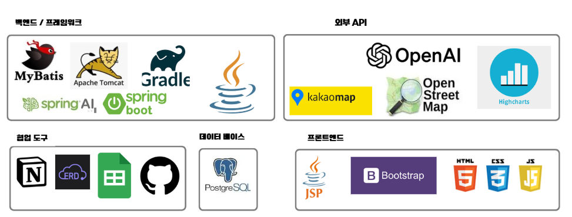
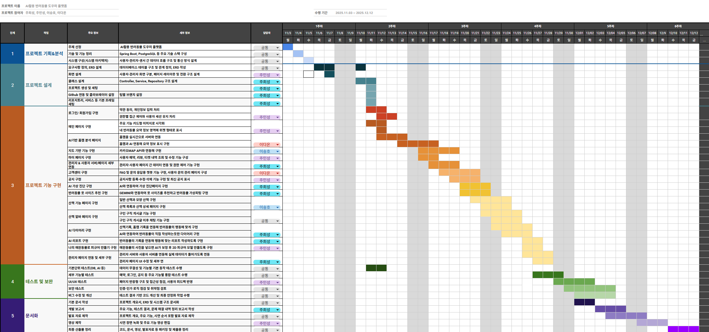
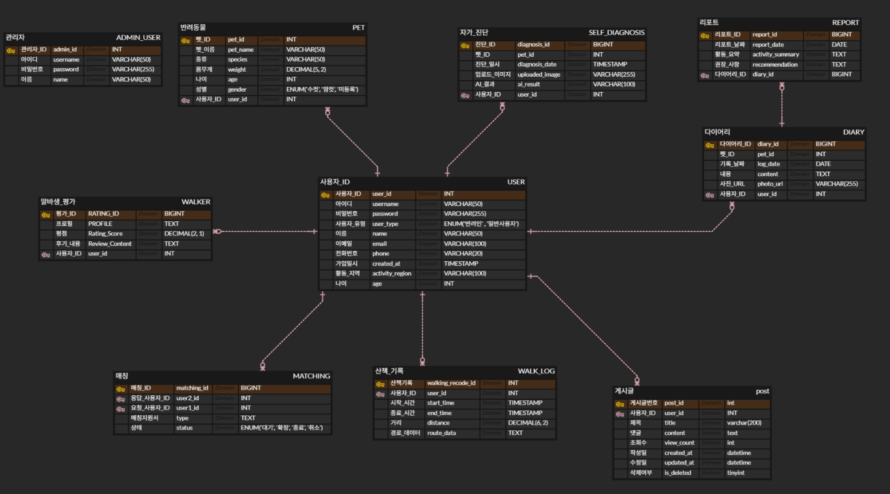
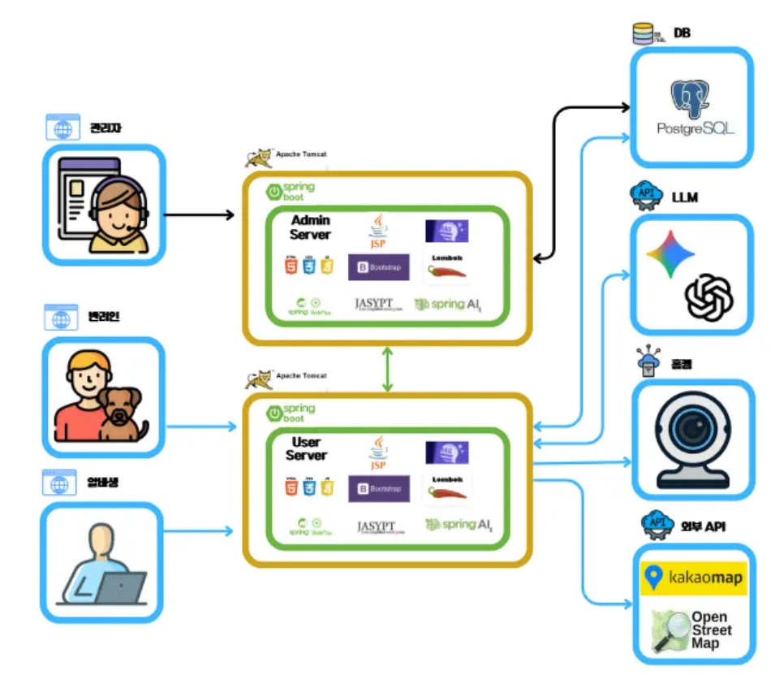
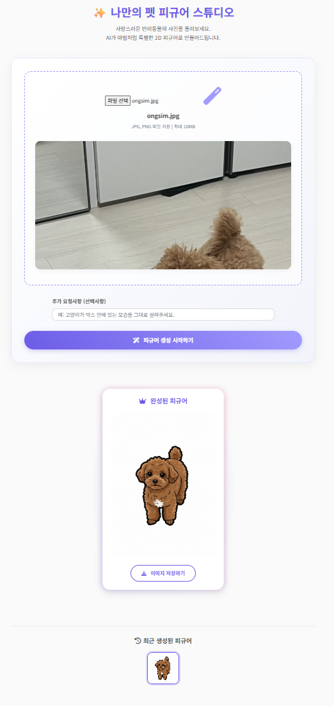

# 🐾 AI 기반 스마트 반려동물 통합 도우미 플랫폼

AI가 반려동물의 **행동 · 건강 · 산책 기록**을 통합 분석하여
반려인의 의사결정을 돕는 **AI 활용 반려동물 관리 플랫폼**입니다.

단순 기능 제공을 넘어,  
반려동물의 전 생애 데이터를 기반으로 **예측·제안·신뢰**를 제공하는 것이 목표입니다.

---

## 📌 프로젝트 배경

대한민국 반려인 천만 시대에 도달했지만,

- 1인가구의 반려동물 **관리의 구조적 어려움**
- 반려동물 돌봄의 **질적 한계**
- 홈캠, 산책, 병원 정보의 **파편화**
- 산책·위탁 돌봄 시 **신뢰 부족**

과 같은 구조적 문제가 존재합니다.

본 프로젝트는 이러한 문제를 해결하기 위해  
**AI · 홈캠 · 위치 기반 기술 · 통합 데이터 분석**을 결합한  
차세대 스마트 반려동물 도우미 시스템을 제안합니다.

---

## 🎯 프로젝트 비전

> **“AI가 반려동물의 모든 일상을 이해하고,  
> 반려인의 결정을 과학적으로 돕는 통합 도우미 플랫폼”**

### 핵심 차별화 요소

- ✅ 행동 + 건강 + 산책 **통합 데이터 분석**
- ✅ AI 비전 기반 **즉각적 상태 진단**
- ✅ GPS·로그 기반 **투명한 위탁 산책**
- ✅ 예측 중심의 **선제적 도움 제안**

---

## 🛠 기술 스택

### Backend
- Spring Boot / Spring MVC
- Spring Security (인증/인가)
- Spring AI (Vision / Tool / RAG)
- MyBatis
- DB: PostgreSQL (Vector Store)
- tomcat server
- Gradle

### AI & Data
- Spring AI (행동·피부·눈·치아 분석)
- Gemini LLM
- Chat-GPT 4o LLM
- RAG 기반 진료비·지식 탐색
- 행동/산책/건강 데이터 분석

### Frontend
- JSP / JSTL
- JavaScript
- Chart.js / Highcharts
- FullCalendar
- Jquery
- bootstrap4

### Infra & Security
- HTTPS (SSL/TLS, KeyStore)
- Jasypt (민감정보 암호화)
- SSE (실시간 알림)

### External
- Kakao Map API
- OpenStreetMap (OSM)
- WebRTC (홈캠)

---

## ✨프로젝트 개요
### WBS

### ERD(추후 수정)

### 시스템 구성

---
## 👤 사용자 기능

### 주요 메뉴
- 🗺 지도 기반 산책 & 시설 제안
- 🤖 AI 산책 & 러닝 코스 챌린지
- 🐕 산책 알바 연계
- 📔 펫 다이어리 / 타임라인
- 📹 AI 홈캠 분석
- 🧠 AI 건강 자가진단
- 👕 옷 사이즈 제안
- 🧸 반려동물 피규어 제작

---

### AI 홈캠 분석
- 실시간 영상 확인
- 행동 상태 인식 (휴식/흥분/이상)
- 이상 징후 탐지 및 긴급 알림
- 다이어리 자동 연동
- (집에서 반려동물 영상으로 홈캠 시연 사진 추가)
---

### AI 산책
- 일반 산책 네비게이션
- AI 러닝 코스 제안 (OSM 기반)
- 경로·거리·시간 자동 저장
- (실제 산책, 저장시 산책 목록 사진)
---

### 산책 알바 매칭
- 구인/구직 게시글
- AI 알바생 제안
- 채팅·영상통화
- 실시간 산책 로그 공유
- 평점 및 후기 시스템

 
- (채팅, 영상통화 추가)
---

### 행동 분석 리포트
- 일/주/월 단위 행동 분석
- 활동량·이상 행동 시각화
- 행동 상담 / 병원 권장 제안
  
---
### AI 다이어리
- 일/주/월 단위 행동 분석
- 활동량·이상 행동 시각화
- 행동 상담 / 병원 권장 제안

---

### AI 가상 진단
- 눈·피부·치아 촬영 업로드
- 예비 상태 판단 (주의/관찰/병원)
- 지역 평균 진료비 제공 (RAG)
- 건강 히스토리 저장

[//]: # (![img_8.png]&#40;image/img_8.png&#41;)

---

### 옷 사이즈 제안
- 전신 이미지 기반 치수 추정
- 계절·용도·색상 제안
- 가상 피팅 이미지 생성
- 추후 쇼핑몰 연계 확장 가능

---
### 나만의 펫 피규어 만들기
- 반려동물 전신 이미지 업로드
- 추가 요청사항을 통해 사용자화
- 자신의 반려동물로 피규어 생성

---

## 🛠 관리자 기능

### 관리자 대시보드
- 서비스 운영 통계
- 실시간 알림 (문의/신고/위급)

### 사용자·펫 관리
- 전체 사용자 조회/필터
- 계정·펫 상태 관리

### 공지·고객센터
- 공지사항 CRUD
- 1:1 문의 응답
- FAQ 관리
- RAG 기반 상담 지원

### 통계/리포트
- 사용자·활성도·산책·알바 통계
- 기간별 분석

---

## 📈 기대 효과

### ✅ 반려동물 안전·건강 증진
- 조기 이상 감지
- 비접촉 가상 AI 진단
- 긴급 대응 강화

### ✅ 반려인 만족도 향상
- 자동 리포트
- 맞춤형 AI 코칭
- 관리 시간 절감

### ✅ 신뢰 기반 도움 생태계
- 투명한 산책 로그
- 알바 평점/기록 공개
- 커뮤니티 확장

---

## 🚀 향후 확장
- 반려동물 커뮤니티 (SNS)
- 박람회/이슈 정보
- 쇼핑몰 연동 (반려동물 AI 피팅)
- 산책 서비스 고도화
- 글로벌 다국어 서비스 (i18n)

---

## 🌍 다국어 지원
- Spring Boot i18n 기반
- 브라우저 자동 감지
- 메뉴/버튼/알림 전체 적용

---

## 🏁 결론

본 프로젝트는

> **AI + 데이터 기반 반려동물 통합 도우미 플랫폼**으로  
> 반려동물과 반려인의 삶을 더 안전하고,
> 더 신뢰 가능하며,
> 더 과학적으로 연결합니다.

